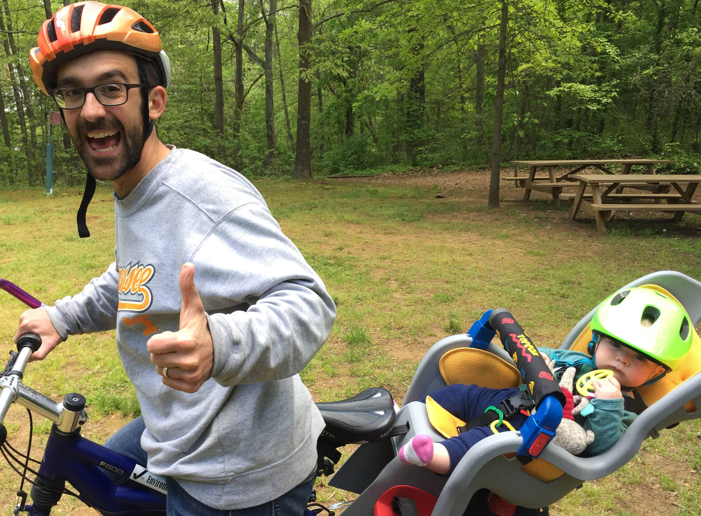
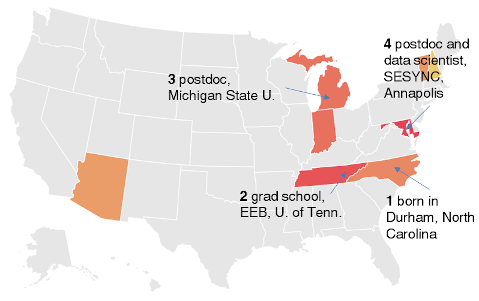
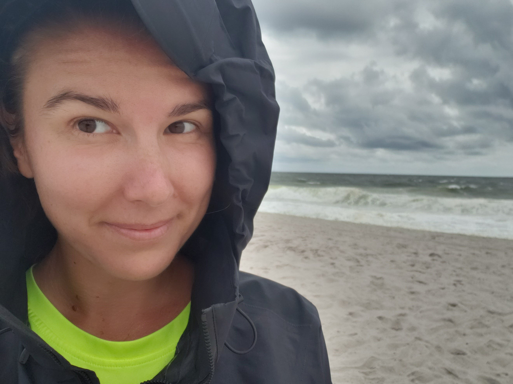

# si2020instructors

## Meet your 2020 Summer Institute instructors!

=======

Hi, I'm [Rachael Blake](http://rachaeleblake.com).  I lead the data science team at SESYNC, and I'm a quantitative marine ecologist.  My research focuses on biodiversity, community structure, and the impacts of multiple stressors in marine ecosystems.  I also study how changes in these ecosystems influence social and ecological well-being.  I use data synthesis as well as field and lab experiments to test assumptions and hypotheses.  I'm interested in furthering open science and use data science tools to improve workflows and reproducibility.  

My goals for this week:
- provide a positive learning space
- learn about your interesting research
- help you overcome specific or conceptual project hurdles
- have fun!

=======

Hi, I'm [Quentin Read](http://quentinread.com)!

I'm a member of the SESYNC data science team. I also do research on the environmental impacts of food waste, assessing different solutions for food waste reduction. I started out as an ecologist, studying the effects of climate change on plant communities, and large-scale biodiversity patterns in mammals, birds, and trees. This map shows my career trajectory --- and it is also my eBird map, showing the different US states where I've seen birds! Besides birding, I like playing Irish music, running, cycling, cooking, and crossword puzzles.

=======

Hi, I'm [Kelly Hondula](https://khondula.github.io/)!

I'm a member of the SESYNC data science team, and I'm also an aquatic ecologist interested in the intersection of hydrology and biogeochemistry. My dissertation is a combination of methane biogeochemistry, hydrology, and remote sensing. I've also done research about stream and river restoration, green infrastructure, and lots of other issues related to water resources. My favorite R package is probably [leaflet](https://rstudio.github.io/leaflet/). Besides making maps, I like skiing, going to the beach, cooking, and improving aquatic science information on Wikipedia through [WikiProjectL&O](https://twitter.com/WikiProjectLO). 

